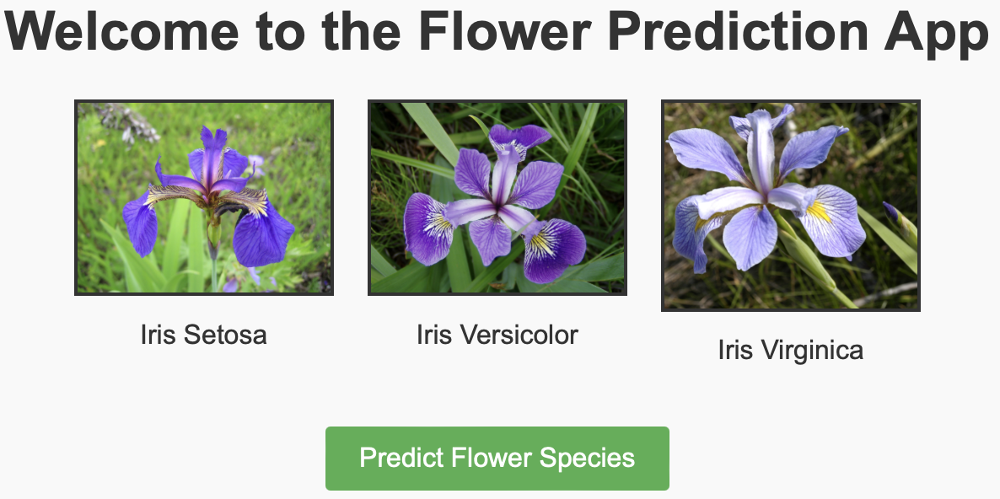

# Iris Prediction App

The project involves building a web application for predicting flower species based on certain input parameters such as sepal length, sepal width, petal length, and petal width.




## Getting Started

### Features

- Predicts iris species using a machine learning model.
- Simple and intuitive web interface.
- Deployed on Heroku for easy scalability and accessibility.

### Prerequisites

- Python 3.x
- `pip` for managing Python packages
- Git for version control
- Heroku CLI for deployment

### Installation
1. Clone the repository:
   ```bash
   git clone https://github.com/kachiann/iris_pred_app.git
   cd iris_pred_app
2. Install the required packages:
    ```bash
    pip install -r requirements.txt
3. Train and save the model:
    ```bash
    python model.py
4. Run the Flask app:
    ```bash
    python app.py
#### Acknowledgements
- Thanks to the [Flask](https://flask.palletsprojects.com/) team for their excellent web framework.
- Thanks to [Heroku](https://www.heroku.com/) for providing a platform for deploying web applications.
- Thanks to the creators of the [Iris dataset](https://archive.ics.uci.edu/ml/datasets/iris) for their work.

## Contact

For any questions or comments, please open an issue or contact me at [kachiann12@gmail.com](mailto:kachiann12@gmail.com).
