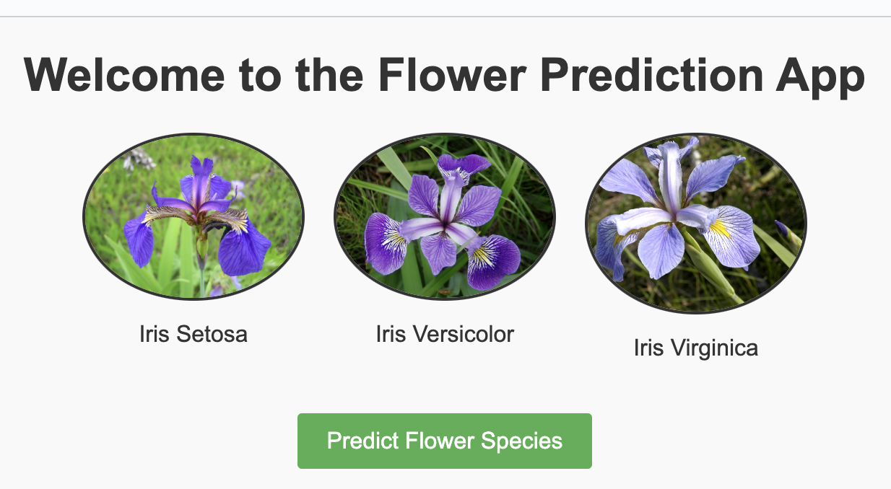

# Iris Prediction App

The project involves building a web application for predicting flower species based on certain input parameters such as sepal length, sepal width, petal length, and petal width.

## Getting Started

### Prerequisites

- Python 3.x
- pip

### Installation
